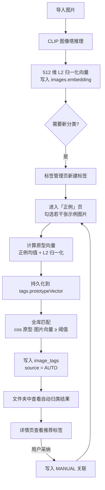

# PixVault

**端侧 AI 相册 / 素材工坊 —— 完全离线运行，用你自己的样本教会它认图**

PixVault 是一款 Android 本地相册与素材管理应用。它把 CLIP 双塔模型完整跑在手机端，用自然语言就能搜图；更重要的是，它内置了一套**端侧自主学习算法**：你只需要为某个标签勾选几张正例图片，它就能自动"学会"这个标签长什么样，并在整个图库中把相似的图片自动归类。

> 全程离线 · 不申请任何权限 · 不联网 · 图片不出设备

## 最新进展

- 优化语义搜图：常见中文描述会在本机转换为 CLIP 更擅长的英文视觉概念，并通过动态相关度门槛过滤弱匹配结果，不再把低相关图片全部展示出来。
- 文件夹页新增“未分类”，自动汇总所有尚未添加标签的普通图片，方便集中整理。
- 私密空间补充持续选择反馈：已选照片显示边框、遮罩和勾选标记，标题与操作按钮同步显示选择数量。
- 时间线顶部场景卡现在可点击打开照片日历；有照片的日期显示紫色圆点，支持前后翻月、按指定日期检索当天图片及一键清除筛选。
- 新增按拍摄日期分组的时间线图库：首页显示日期标题，月份栏滚动吸顶。
- 新增私密空间：从首页批量移入，使用系统生物识别/锁屏凭据解锁，并在私密页禁止截图。
- 新增照片 EXIF 信息与照片地图；旧图库会在后台一次性补齐拍摄时间和 GPS 索引。
- 新增全库相似照片分组整理，可保留建议主图并批量移入回收站。
- 底部主导航升级为图库、时间线、私密、设置四页，包含选中状态与轻微动画。
- 深色模式使用专门调校的靛蓝—柔紫配色，不再依赖系统动态取色。
- 首页在图库有内容时显示“今日图库”角色卡，展示照片数量与每日轮换的搜索灵感。
- 多选操作栏改为收藏、加标签、私密、删除四个等宽图标项，小屏幕下文字保持单行。
- 图片详情使用智能预览：普通图片完整适应、长图按宽度纵向阅读、全景图按高度横向浏览。
- 设置页按外观、隐私、AI、存储、帮助重新分组，角色表情入口可打开六宫格图鉴。
- 接入横向时间线场景插画、六态角色表情、角色加载动画与统一矢量图标组；欢迎、搜索、加载、守护、发现、休息分别用于新手指引、语义搜索、处理进度、私密空间、相似整理与空回收站。
- 永久删除和清空回收站现在会同步清理应用私有目录中的图片副本。
- 图片编辑使用原始分辨率输出，不再静默缩小大图。
- 导入时计算 SHA-256，自动跳过内容完全相同的重复图片。
- 图库支持最新、最早、名称、大小排序，以及 2–5 列网格切换。
- ONNX Runtime 已升级并兼容 16 KB 内存页设备。
- Release 构建启用 R8 与资源压缩，签名密钥不进入仓库。
- Room schema 已纳入版本管理，数据库升级不再使用清库兜底。

> ONNX 模型使用 Git LFS 管理。克隆后请先安装 Git LFS，并执行 `git lfs pull`。

---

## 目录

- [一、项目简介](#一项目简介)
- [二、核心亮点：端侧自主学习算法](#二核心亮点端侧自主学习算法)
- [三、功能特性](#三功能特性)
- [四、技术栈](#四技术栈)
- [五、项目结构](#五项目结构)
- [六、快速开始](#六快速开始)
- [七、软件使用说明](#七软件使用说明)
- [八、模型文件说明](#八模型文件说明)
- [九、常见问题](#九常见问题)
- [十、官方客服群](#十官方客服群)
- [十一、开源协议](#十一开源协议)

---

## 一、项目简介

PixVault 解决的是一个很实际的问题：**素材越攒越多，但找起来越来越难**。

传统相册只能按时间、文件名找图；云端相册虽然能自动分类，但要求你把私人照片上传到别人的服务器。PixVault 的选择是：把 AI 推理放在你自己的手机上，让分类规则由你自己定义。

它由两条技术主线构成：

### 1. 多模态理解（CLIP 双塔）

基于 **CLIP ViT-B/32** 的图像编码器与文本编码器，把"图片"和"自然语言"映射到**同一个 512 维向量空间**。因此可以直接比较一段文字和一张图片的相似度——这就是"用一句话搜图"的原理，无需为任何图片写描述、打标签。

### 2. 端侧自主学习（Few-shot 标签学习）

CLIP 本身是通用模型，它知道"这是一只猫"，但不知道"这是我的商品主图"或"这是我拍的夜景素材"。PixVault 的做法不是去微调模型（手机端既慢又耗电），而是引入一层**轻量级小样本学习**：

> 你勾选几张正例 → 应用计算这些图片的"视觉原型" → 用余弦相似度在全库中找出同类图片。

整个"学习"过程只涉及一次向量均值计算，**毫秒级完成、无需训练、完全可解释、随时可重来**。

---

## 二、核心亮点：端侧自主学习算法

这是 PixVault 与普通相册应用最大的区别，也是本项目的技术核心。

### 2.1 一句话概括

> 标签的"识别能力"不是预训练好的，而是**用户用几张示例图片现场教出来的**，并且可以随时通过增删示例、调整阈值来重新训练。

算法本质属于**最近类均值（Nearest Class Mean）**式的原型学习，配合 CLIP 强大的零样本特征提取能力，用极小的成本实现了"自定义分类器"。

### 2.2 算法原理

**第一步：把图片变成单位球面上的点**

图像编码器把任意一张图片映射为 512 维向量，并做 L2 归一化：

```
f_img(image) → v ∈ R^512,   ‖v‖₂ = 1
```

归一化之后，所有图片都落在半径为 1 的超球面上，此时**余弦相似度退化为点积**，计算极快。

**第二步：用正例计算标签原型**

用户为标签 `t` 勾选的图片集合记为 `S_t = {x₁, x₂, …, xₙ}`，先取向量均值，再做一次 L2 归一化，得到该标签的**原型向量**（即类中心）：

```
p_t = normalize( (1/n) · Σ f_img(xᵢ) )
```

这一步对应代码 `VectorUtils.mean()`：先逐维求平均，再归一化。原型向量会被持久化到数据库 `tags.prototypeVector` 字段。

**第三步：全库匹配**

对图库中每一张已生成向量的图片计算与原型的方向一致性：

```
sim = cos(p_t, v) = p_t · v
```

若 `sim ≥ τ_t`，则该图片自动归入标签 `t`（写入 `image_tags`，来源标记为 `AUTO`，并记录相似度分值）。

其中 `τ_t` 是标签的**判定阈值**，默认 `0.30`，用户可在 `0.10 ~ 0.95` 之间自由调节：

- 阈值调低 → 命中更多，但可能混入不相关图片
- 阈值调高 → 结果更纯净，但可能漏掉部分同类图片

**第四步：用户反馈回到第一步**

详情页会根据原型向量反查"推荐标签"（只读、不落库）。用户采纳后即形成新的标注，下次再调整正例集合时，原型向量会被重新计算——**这就是"学习"的闭环**。

### 2.3 学习闭环流程图



### 2.4 关键实现对照

| 环节 | 关键函数 | 文件位置 |
| --- | --- | --- |
| 图片 → 向量 | `ClipImageEncoder.encodeNormalized` | `app/src/main/java/com/pixvault/ml/ClipImageEncoder.kt` |
| 文本 → 向量 | `ClipTokenizer.encode` → `ClipTextEncoder.encodeNormalized` | `app/src/main/java/com/pixvault/ml/` |
| 编码器生命周期管理 | `EmbeddingService.ensureLoaded / embed` | `app/src/main/java/com/pixvault/data/embedding/EmbeddingService.kt` |
| 计算标签原型 | `TagRepository.computePrototype` | `app/src/main/java/com/pixvault/data/repository/TagRepository.kt` |
| 全库自动匹配 | `TagRepository.autoMatch` | `app/src/main/java/com/pixvault/data/repository/TagRepository.kt` |
| 推荐标签（只读） | `TagRepository.getSimilarTags` | `app/src/main/java/com/pixvault/data/repository/TagRepository.kt` |
| 相似图检索 | `ImageRepository.findSimilar`（Top-20） | `app/src/main/java/com/pixvault/data/repository/ImageRepository.kt` |
| 语义搜图 | `SemanticQueryTranslator.normalize` + `ImageRepository.searchByText` | `app/src/main/java/com/pixvault/data/util/`、`data/repository/` |
| 向量工具（余弦/均值/序列化） | `VectorUtils` | `app/src/main/java/com/pixvault/data/util/VectorUtils.kt` |

### 2.5 语义搜图：零样本能力

除了自定义标签，CLIP 的零样本能力也被直接利用。用户在首页切换到「语义」模式后输入自然语言（例如"一只在草地上奔跑的狗"），应用会：

1. 用**自研 CLIP BPE 分词器**把文本编码为 77 长度的 token 序列（含 BOS/EOS 与 padding）；
2. 经文本塔推理得到 512 维文本向量并 L2 归一化；
3. 中文查询先通过本地视觉概念词表转换为模型更擅长的英文描述，整个过程不联网；
4. 与库中所有图片向量计算余弦相似度，使用“绝对下限 + 相对最佳分数”的动态门槛过滤弱匹配，最多返回 24 张高相关图片。

由于图像塔与文本塔来自同一个 CLIP 模型，两者输出处于**同一投影空间**，跨模态比较才成立。项目在开发阶段已用官方 `tokenizers` 实现做过逐 token 全量比对（覆盖中文、重音字符、超长截断等场景），并补齐了 NFC 归一化。

> 分词器为纯 Kotlin 自研实现，不依赖任何 Python 运行时或第三方 NLP 库。

### 2.6 设计取舍与已知局限

开源项目应当坦诚地说明边界。当前版本的设计取舍如下：

**优点**

- **零训练成本**：一次原型计算就是一次向量均值，手机端瞬间完成；
- **完全可解释**：判定依据就是"与示例图片的余弦相似度 + 阈值"，没有黑盒；
- **可逆可重来**：正例集合随时增删，阈值随时调整，重算即可；
- **隐私友好**：模型权重永不改变，用户样本永不出设备。

**已知局限（欢迎 PR 改进）**

- **原型采用算术均值**：对该标签下风格差异很大的多模态素材（例如"我的作品"里既有插画又有摄影）表达能力有限，可升级为多原型 / 聚类中心；
- **暂无负样本机制**：无法主动"排斥"某类图片，只能通过提高阈值或补充正例来间接修正；
- **阈值不自动调优**：需要用户按"命中数量 vs 准确度"手动权衡；
- **全量重算**：每次保存正例都会对全库做一次点积扫描（O(N×D)，D=512）。万级图库无压力，十万级建议引入 ANN 索引（如 HNSW）与增量更新；
- **图像向量仅使用全局特征**：不做主体检测与区域特征，细粒度区分能力受限于 CLIP ViT-B/32 本身。

---

## 三、功能特性

### 图库与检索

- **批量导入**：通过系统 Photo Picker 选择图片，自动拷贝到应用私有目录并读取尺寸、体积、MIME 等元数据；
- **时间线网格**：按拍摄时间分月、分日展示，月份标题支持滚动吸顶；
- **相册网格**：支持 2–5 列切换、多选、批量收藏、批量打标签、移入私密空间与回收站；
- **语义搜图**：用自然语言描述画面内容进行检索（如"蓝色的天空"、"一只橘猫"）；
- **中文语义增强**：常见人物、动物、颜色、场景和动作描述会在本机转换为英文视觉概念，并自动剔除相关度不足的结果；
- **今日图库助手**：图库有内容时持续显示主角色、照片数量与每日轮换的语义搜索示例；
- **文件名 / 标签过滤**：传统关键字与 `#标签` 混合过滤；
- **相似图检索**：以任意一张图为基准，按余弦相似度排序找出库中相似素材，并显示相似度百分比。

### 自主学习与标签

- **自定义标签**：标签即"文件夹"，可新建、重命名、删除；
- **正例样本管理**：为每个标签勾选若干示例图片；
- **可视化阈值调节**：滑块实时设定判定阈值（0.1 ~ 0.95）；
- **一键保存并匹配**：计算原型向量 → 全库重新归类 → 回显命中数量；
- **推荐标签**：详情页展示模型推理出的候选标签，一键采纳；
- **安全兜底**：重新匹配只会覆盖 `AUTO` 关联，**不会**动用户手动标注（`MANUAL`）的标签。

### 浏览、编辑与整理

- **私密空间**：普通图库、收藏、标签与搜索自动排除私密照片；使用系统认证解锁，私密页面启用防截图；多选时持续显示边框、遮罩、勾选与数量反馈；
- **照片信息与地图**：读取 EXIF 拍摄时间与 GPS，详情页显示坐标并可跳转系统地图；
- **相似整理**：按本地图像向量自动生成相似组，选择冗余照片后批量移入回收站；
- **详情页**：大图预览、左右翻页、重命名、收藏、标签增删、导出到系统相册；
- **智能预览**：按图片比例自动切换完整适应、长图上下阅读与全景左右浏览，点击仍可进入全屏缩放；
- **全屏查看器**：双指缩放（1x ~ 6x）、拖动、双击 2 倍与复位；
- **图片编辑**：
  - 裁剪：自由裁剪 + 1:1 / 4:3 / 16:9 / 3:4 / 9:16 预设比例；
  - 涂鸦：5 种预设色 + 取色器，3 档笔宽；
  - 文字：8 种颜色、4 种字体、粗体 / 斜体 / 下划线 / 删除线；
  - 撤销 / 重做 / 重置，输出 PNG / JPEG / WEBP 并支持质量调节，可覆盖原图或另存为新图；
- **文件夹视图**：收藏夹、未分类、回收站与各标签文件夹一目了然；“未分类”自动收纳所有没有标签的普通图片；
- **收藏夹**：常用素材独立归集；
- **回收站**：删除均为软删除（保留原文件与标签关联），支持多选恢复、彻底删除、一键清空。

### 个性化

- **主题**：跟随系统 / 浅色 / 深色三态切换，深色使用专门调校的靛蓝—柔紫方案；
- **导航**：图库 / 时间线 / 私密 / 设置四个主入口，带选中状态与轻微动画；
- **视觉资源**：横向场景插画、六态角色表情、角色加载动画与统一图标组；设置页可打开角色表情图鉴；
- **设置页**：按外观、隐私、AI、存储、帮助分组；帮助中可跳转 GitHub 项目，二维码只在反馈入口弹窗中显示。

---

## 四、技术栈

| 分类 | 技术 | 版本 |
| --- | --- | --- |
| 语言 | Kotlin | 2.2.10 |
| 构建 | Android Gradle Plugin / Gradle Wrapper | 9.3.2 |
| UI | Jetpack Compose (Material 3) | Compose BOM 2026.02.01 |
| 架构 | 单 Activity + Compose 路由 + Repository 分层 | — |
| 本地存储 | Room (KSP) | 2.7.2 |
| 图片加载 | Coil | 3.2.0 |
| 端侧推理 | ONNX Runtime for Android | 1.30.0 |
| AI 模型 | CLIP ViT-B/32（图像塔 + 文本塔，512 维） | — |
| 分词器 | 自研 CLIP BPE（纯 Kotlin，NFC 归一化） | — |
| 最低 / 目标 SDK | minSdk 24 / targetSdk 37 | — |
| ABI | arm64-v8a、x86_64 | — |
| 协程 | kotlinx.coroutines | — |

**架构分层**

```
UI 层（Compose Screen）
    ↓
Repository 层（ImageRepository / TagRepository）← 业务与算法编排
    ↓
数据访问层（Room DAO / Entity）
    ↓
ML 层（ClipImageEncoder / ClipTextEncoder / ClipTokenizer）+ EmbeddingService
```

**权限说明**：应用**未申请任何权限**（无 INTERNET、无存储权限）。图片通过系统 Photo Picker 选择，属于系统授权行为；应用自身全程离线。

---

## 五、项目结构

```
PixVault/
├── app/
│   ├── build.gradle.kts                     # 模块构建配置（SDK、ABI、依赖）
│   ├── proguard-rules.pro
│   └── src/
│       ├── main/
│       │   ├── AndroidManifest.xml
│       │   ├── assets/                      # 端侧模型与词表
│       │   │   ├── MODEL_README.txt         # 模型放置说明
│       │   │   ├── vocab.json               # CLIP BPE 词表
│       │   │   ├── merges.txt               # CLIP BPE 合并规则
│       │   │   ├── image-encoder.onnx       # 图像塔（需自行下载，见第八节）
│       │   │   └── text-encoder.onnx        # 文本塔（需自行下载，见第八节）
│       │   ├── keepRules/rules.keep
│       │   ├── java/com/pixvault/
│       │   │   ├── MainActivity.kt          # 单 Activity 入口 + 页面路由
│       │   │   ├── PixVaultApp.kt           # Application，数据库与迁移初始化
│       │   │   ├── ml/                      # ★ 端侧模型层
│       │   │   │   ├── ClipImageEncoder.kt  #   图像塔 ONNX 推理 + 预处理
│       │   │   │   ├── ClipTextEncoder.kt   #   文本塔 ONNX 推理
│       │   │   │   └── ClipTokenizer.kt     #   自研 CLIP BPE 分词器
│       │   │   ├── data/
│       │   │   │   ├── db/                  # Room 数据库
│       │   │   │   │   ├── AppDatabase.kt   #   版本与 Migration
│       │   │   │   │   ├── dao/             #   ImageDao / TagDao / ImageTagDao
│       │   │   │   │   └── entity/          #   images / tags / image_tags 表
│       │   │   │   ├── embedding/
│       │   │   │   │   └── EmbeddingService.kt   # 编码器加载与向量计算
│       │   │   │   ├── repository/          # ★ 学习算法编排层
│       │   │   │   │   ├── ImageRepository.kt    # 相似图 / 语义搜图 / 回收站
│       │   │   │   │   └── TagRepository.kt      # 原型计算 / 全库匹配 / 推荐
│       │   │   │   ├── importer/ImageImporter.kt # 导入与元数据读取
│       │   │   │   ├── processor/ImageProcessor.kt # 裁剪/涂鸦/文字/导出
│       │   │   │   └── util/VectorUtils.kt  # 余弦 / 均值 / 归一化 / 序列化
│       │   │   └── ui/
│       │   │       ├── screen/              # Compose 页面与复用组件（见下）
│       │   │       └── theme/               # 颜色、字体、主题模式
│       │   └── res/                         # 图标、字符串、主题、群二维码
│       ├── test/                            # 单元测试
│       └── androidTest/                     # 仪器测试
├── gradle/
│   ├── libs.versions.toml                   # 依赖版本目录
│   └── wrapper/                             # Gradle Wrapper
├── build.gradle.kts
├── settings.gradle.kts
├── gradle.properties
├── gradlew / gradlew.bat
├── LICENSE
└── README.md
```

**页面一览（`ui/screen/`）**

| 文件 | 页面职责 |
| --- | --- |
| `HomeScreen.kt` | 今日图库角色卡、时间分组网格、导入、筛选、语义搜图、多选图标操作栏 |
| `DetailScreen.kt` | 图片详情、改名、收藏、标签管理、推荐标签、找相似、导出 |
| `ImageViewerScreen.kt` | 全屏查看，缩放与拖动 |
| `ImageEditorScreen.kt` | 裁剪 / 涂鸦 / 文字编辑与导出 |
| `TagManagerScreen.kt` | 标签列表、新建、删除、进入正例 |
| `PositiveSelectScreen.kt` | **正例选择与阈值调节（学习入口）** |
| `SimilarImagesScreen.kt` | 相似图结果展示 |
| `FolderListScreen.kt` | 文件夹总览（收藏、未分类、回收站、标签） |
| `UntaggedImagesScreen.kt` | 未分类图片列表，自动展示没有任何标签的图片 |
| `FolderImagesScreen.kt` | 单个文件夹内图片 |
| `FavoritesScreen.kt` | 收藏夹 |
| `TrashScreen.kt` | 回收站（恢复 / 彻底删除 / 清空） |
| TimelineScreen.kt / TimelineGallery.kt | 时间线场景、带照片日期标记的日历检索、日期分组网格与吸顶月份栏 |
| PrivateSpaceScreen.kt | 系统认证、私密图库、防截图与持续多选反馈 |
| PhotoMapScreen.kt | 带 GPS 照片列表与系统地图跳转 |
| SimilarCleanupScreen.kt | 全库相似组分析与批量整理 |
| SettingsScreen.kt | 外观、隐私、AI、存储、帮助分组设置 |
| `GroupBuyScreen.kt` | 周边团购信息页 |

---

## 六、快速开始

### 环境要求

- Android Studio（建议较新版本，支持 AGP 9.x）
- JDK 17 及以上（Android Studio 自带 JBR 即可）
- Android SDK Platform 37
- 一台 Android 7.0（API 24）及以上的设备，或对应 API 的模拟器

### 构建步骤

1. **克隆仓库**

   ```bash
   git clone <你的仓库地址>
   cd PixVault
   ```

2. **下载端侧模型**（仓库不包含，共约 146 MB，见[第八节](#八模型文件说明)）

   把两个 `.onnx` 文件放入：

   ```
   app/src/main/assets/image-encoder.onnx
   app/src/main/assets/text-encoder.onnx
   ```

3. **打开并运行**

   用 Android Studio 打开工程，等待 Gradle 同步完成后直接运行 `app` 配置。

   或使用命令行：

   ```bash
   # Windows
   gradlew.bat assembleDebug

   # macOS / Linux
   ./gradlew assembleDebug
   ```

   > `local.properties` 已被 `.gitignore` 排除，Android Studio 会自动生成；命令行构建需确保已设置 `ANDROID_HOME`（或 `ANDROID_SDK_ROOT`）。

### 构建提示

- 首次运行会按需把模型拷贝到应用私有目录，届时需要等待数秒；
- 图像塔在首次导入图片时加载，文本塔仅在首次使用「语义搜图」时**懒加载**；
- `release` 构建当前复用 debug 签名，仅供本地自测，正式发布请替换为自己的签名配置。

---

## 七、软件使用说明

### 1. 导入图片

首页点击**导入**按钮 → 系统图片选择器（可多选）→ 确认后应用会把图片拷贝到私有目录并自动计算图像向量，进度以"计算特征 n/N"显示。若在选择时同时指定标签，则这些图片会立刻归入该标签。

> 建议首次多导入一些图片，向量计算是后续所有检索与学习的基础。

### 2. 浏览与检索

- **默认模式**：输入关键字过滤文件名，或输入 `#标签名` 过滤标签；
- **语义模式**：点击搜索框下方的模式切换按钮，输入中英文自然语言描述（如“海边的日落”或 “purple sky”），点击「搜索」。常见中文视觉概念会在本机转换，结果经过相关度过滤后按相似度排序。

### 3. 让标签"学会"认图（核心玩法）

这是 PixVault 最具特色的功能，四步即可拥有一个专属分类器：

1. **新建标签**
   首页 → **标签** → 新建标签，例如"夜景"。

2. **挑选正例**
   在标签列表中点击该标签右侧的**正例**入口，进入图片网格，勾选 3 ~ 10 张最能代表该标签的图片。

   > 样本原则：**少而准**。正例只放"绝对属于该标签"的图片，宁缺毋滥。

3. **调节阈值并保存**
   拖动阈值滑块（默认 0.30），点击**保存并匹配**：

   - 应用会计算这些正例的原型向量；
   - 然后扫描全库，把相似度不低于阈值的图片自动归入该标签（来源标记为自动）；
   - 完成后会提示命中数量，例如"完成：命中 27 张（阈值 0.30）"。

4. **检查与迭代**
   进入文件夹查看自动归类结果：

   - **漏了** → 把漏掉的图片补进正例，或适当调低阈值；
   - **混入了不相关的** → 提高阈值，或移除不够典型的正例。

   重复第 2 ~ 4 步，分类效果会越来越准。手动打的标签不会被自动匹配覆盖，可以放心使用。

### 4. 查看与整理

- **相似图**：详情页点击「找相似」，按相似度查看库中相近素材；
- **推荐标签**：详情页会列出模型推荐的标签，点击即可采纳为手动标签；
- **收藏**：详情页或网格多选中点击收藏；
- **重命名 / 导出**：详情页可改名，也可导出回系统相册。

### 5. 编辑图片

详情页进入编辑，底部工具栏提供四种模式：

| 模式 | 能力 |
| --- | --- |
| 查看 | 手势缩放、拖动 |
| 裁剪 | 自由裁剪，或使用 1:1 / 4:3 / 16:9 / 3:4 / 9:16 预设 |
| 涂鸦 | 5 种预设色 + 取色器，3 档笔宽 |
| 文字 | 8 色、4 字体，粗体 / 斜体 / 下划线 / 删除线 |

支持撤销、重做、重置；导出时可选择 PNG / JPEG / WEBP、调节质量，并决定覆盖原图或另存为新图。

### 6. 文件夹、收藏与回收站

- **文件夹**页汇总了收藏夹、未分类、回收站与所有标签文件夹；
- **未分类**会实时汇总所有尚未添加标签的普通图片，添加标签后图片会自动离开该文件夹；
- 删除图片会先**移入回收站**，原文件与标签关联都会保留；
- 在回收站中可以多选**恢复**、**彻底删除**，或一键**清空回收站**（此操作不可撤销）。

### 7. 设置

- 外观：跟随系统 / 浅色 / 专用紫蓝深色；
- 隐私：进入私密空间与查看本地处理说明；
- AI：进入相似照片整理；
- 存储：进入照片地图与回收站；
- 帮助：访问 GitHub 项目、重新播放新手指引、查看角色表情，以及按需打开反馈群二维码。

> 私密空间提供应用内隐藏、系统身份验证和防截图；它不额外改写或加密图片文件，设备层面的静态数据保护仍由 Android 系统负责。

---

## 八、模型文件说明

仓库为控制体积**未包含**模型权重（`*.onnx` 已被 `.gitignore` 排除），词表文件已随仓库提供。

| 文件 | 体积 | 必需性 | 说明 |
| --- | --- | --- | --- |
| `image-encoder.onnx` | 约 85 MB | **必需** | 图像塔，负责生成图片向量；缺失则无法导入/检索 |
| `text-encoder.onnx` | 约 61.5 MB | 语义搜图必需 | 文本塔（量化版），仅在使用语义搜图时懒加载 |
| `vocab.json` | 约 862 KB | 已包含 | CLIP BPE 词表 |
| `merges.txt` | 约 525 KB | 已包含 | CLIP BPE 合并规则 |

使用 HuggingFace 仓库 `Xenova/clip-vit-base-patch32` 的 ONNX 权重，按下列对应关系重命名后放入 `app/src/main/assets/`：

| 下载文件 | 重命名为 |
| --- | --- |
| `onnx/model.onnx` | `image-encoder.onnx` |
| `onnx/text_model_quantized.onnx` | `text-encoder.onnx` |
| `vocab.json` | `vocab.json`（仓库已包含，可跳过） |
| `merges.txt` | `merges.txt`（仓库已包含，可跳过） |

若访问 HuggingFace 主站有困难，可使用镜像域名替换 `huggingface.co`：

```
https://hf-mirror.com/Xenova/clip-vit-base-patch32/resolve/main/onnx/model.onnx
https://hf-mirror.com/Xenova/clip-vit-base-patch32/resolve/main/onnx/text_model_quantized.onnx
```

模型接口约定（`MODEL_README.txt` 中有同样说明）：

- **图像塔**：输入 `float32`，NCHW 布局 `[1, 3, H, W]`（通常 224×224）；输出 `float32` `[1, 512]`，输出名 `image_embeds`；
- **文本塔**：输入 `int64` `[batch, 77]`（`input_ids`）；输出 `float32` `[batch, 512]`，输出名 `text_embeds`；
- 两塔必须来自同一 CLIP 模型，输出需处于同一投影空间（本项目为 512 维）；
- 支持 FP32 / FP16 / INT8 量化模型，代码会从 ONNX 输入 shape 动态读取分辨率。

> **想直接提交模型？** 请使用 [Git LFS](https://git-lfs.com/) 管理 `*.onnx`，或将其上传到 GitHub Releases，而不是以普通文件提交（单个文件超过 100 MB 会被 GitHub 拒收）。

---

## 九、常见问题

**Q：为什么仓库里没有模型文件？**
A：两个 ONNX 模型合计约 146 MB，超过 GitHub 单文件 100 MB 限制。请按第八节自行下载放入 `app/src/main/assets/`。

**Q：应用需要联网吗？会不会上传我的照片？**
A：完全不需要。应用未声明 `INTERNET` 权限，也不申请存储权限，所有推理都在本机完成。

**Q：为什么自动匹配结果不理想？**
A：优先检查正例质量。正例要"纯"——只包含明确属于该标签的图片；其次调整阈值，先降低阈值看命中范围，再逐步调高筛选质量。

**Q：手动打的标签会被自动匹配覆盖吗？**
A：不会。自动匹配只写入和覆盖来源为 `AUTO` 的关联，手动标注（`MANUAL`）始终保留。

**Q：图片很多时会不会很慢？**
A：向量计算是导入时一次性完成的，之后检索只是点积比较。当前实现为全库扫描，万级图库体验良好；更大规模建议引入 ANN 索引。

**Q：支持哪些 CPU 架构？**
A：当前打包 `arm64-v8a` 与 `x86_64`，覆盖绝大多数现代真机与模拟器。

---

## 十、官方客服群

使用中遇到问题、想提建议或反馈 Bug，欢迎加入官方 QQ 客服群：

**QQ 群：305402575**

也可以在应用的「设置」页查看群二维码，点击可放大后扫码进群。

> 提交 Issue 时，建议附上设备型号、Android 版本与问题复现步骤，便于快速定位。

---

## 十一、开源协议

本项目基于 **Apache License 2.0** 开源，详见 [LICENSE](LICENSE)。

你可以自由地使用、修改、分发本项目（包括商业用途），但需保留版权声明与协议文本。

使用的第三方模型与资源版权归其各自所有者所有：

- CLIP 模型权重：遵循其原始发布仓库的许可条款（`Xenova/clip-vit-base-patch32`）；
- ONNX Runtime：MIT License；
- AndroidX / Jetpack Compose / Coil 等：Apache License 2.0。

**免责声明**：AI 推理结果仅为辅助参考，可能存在误判；请在执行删除、覆盖等不可逆操作前自行确认。应用内「周边团购」页面为第三方商品信息，与本开源项目无隶属关系。
